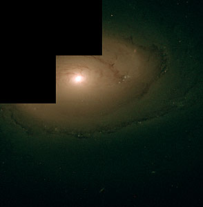

# Hubble Heritage Image Data Repository

## Description

Welcome to the Hubble Heritage Image Data Repository. This repository houses a rich collection of astronomical images scraped from the Hubble Heritage website and manually cleaned for use in various image processing and deep learning tasks. The curated dataset serves as a base for projects and research in astronomical image analysis, particularly in the realm of image colorization powered by deep learning techniques.

## Repository Structure

The repository consists of the following main components:
- `crawler/`: Contains the Python script used for scraping images from the Hubble Heritage site.
- `heritage_data/`: The directory where the cleaned and processed images are stored.
- `project_paper.pdf`: Paper that inspired the curation of dataset.

## Run the Scraper

Clone the repository with:

```bash
git clone https://github.com/Sunanda-K-H/DA323_Dataset.git
```

Navigate to the cloned directory:

```bash
cd DA323_Dataset
```

To run the scraper script:

```bash
python esahubble.py
```

# Example Data




# License

This project is licensed under the MIT License - see the [LICENSE](LICENSE) file for details.

# Acknowledgments

Credit to the Hubble Heritage project for providing the original imagery.
Inspired by the research done on "Astronomical Image Colorization with Deep Learning."
